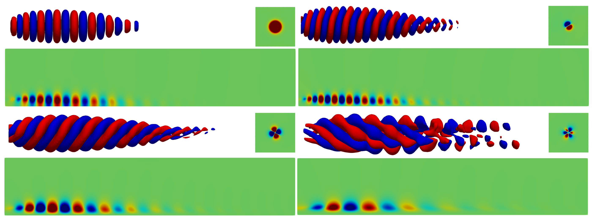

# $\text{RSVD}-\Delta t$: Randomized Singular Value Decomposition with Time-stepping for large-scale resolvent analysis

Copyright © 2024 The Regents of the University of Michigan

Welcome to $\text{RSVD}-\Delta t$, a novel algorithm designed to address the computational challenges associated with studying coherent structures in large-scale flows using resolvent analysis. This README file provides an overview of the algorithm, its features, and instructions for usage. The figures below show the resolvent response modes of a three-dimensional jet, exemplifying the utility of $\text{RSVD}-\Delta t$.



## Overview

Resolvent analysis is a valuable tool for studying coherent structures in turbulent flows. However, its application to inherently three-dimensional flows and large systems has been limited by the computational cost of computing resolvent modes. $\text{RSVD}-\Delta t$ presents a solution to these challenges by combining randomized singular value decomposition (RSVD) with an optimized time-stepping method, resulting in significant reductions in CPU cost and memory requirements.

## Important Note

For harmonic resolvent analysis, please use the package available in the **[harmonic-resolvent-analysis branch](https://github.com/AliFarghadan/RSVD-Delta-t/tree/Harmonic-resolvent-analysis)**. 

> **Important:** The source codes and input variables differ between the default branch and the harmonic resolvent analysis branch, so ensure you are using the correct branch for your analysis.

## What We Are Computing

We are using the $\text{RSVD}-\Delta t$ algorithm to compute resolvent modes of the linearized Navier-Stokes (LNS) equations. The resolvent operator $R$ is defined as

$$
R = C(\text{i}\omega I - A)^{-1} B,
$$

where $A$ is the LNS operator. $B$ and $C$ are input and output matrices, respectively. $R$ maps the input forcing to the output response in the frequency domain and can be expressed in terms of its singular vectors and values as 
$$
R = U \Sigma V^*.
$$

In our weighted formulation, we compute the weighted resolvent operator $\tilde{R}$ as

$$
\tilde{R} = W_q^{1/2} C (\text{i}\omega I - A)^{-1} B W_f^{-1/2} = \tilde{U} \Sigma \tilde{V}^*,
$$

where the results are saved as

$$
U = W^{-1/2}_q \tilde{U},
$$

$$
V = W^{-1/2}_f \tilde{V},
$$

By the end of the simulation, resolvent modes (*i.e.*, gains, forcing, and response) are computed using time-stepping across all frequencies. In case $B$, $C$, $W_q^{1/2}$, or $W_f^{-1/2}$ are not defined, we assume they are identity matrices.


## Features

- **Linear CPU time scalability**: Computational complexity scales linearly with the number of discrete degrees of freedom, $O(N)$, which significantly reduces computational overhead for large systems compared to existing algorithms.
- **Linear memory usage scalability**: Memory usage also scales linearly with the number of discrete degrees of freedom, $O(N)$, and the total required memory is further minimized using streaming Fourier sums, facilitating the study of high-dimensional systems.
- **Error control strategies**: The tool incorporates strategies such as power iteration and transient removal to manage errors and ensure the reliability of the results.
- **User-friendly interface**: $\text{RSVD}-\Delta t$ features an input list for specifying directories and parameters, as outlined in this README. Computations are managed by an executable that leverages parallel processing via PETSc and SLEPc libraries, allowing researchers to focus on analysis rather than computational demands.


## Usage

To use $\text{RSVD}-\Delta t$, follow these steps:

1. **Install dependencies**:
	* OpenMPI (or similar MPI package)
	* C++ compiler
	* PETSc and SLEPc packages (our codes are developed on versions PETSc 3.19.4 and SLEPc 3.19)
2. **Download and extract** the $\text{RSVD}-\Delta t$ package.
3. **Navigate** to the directory containing the extracted files.
4. **Build the executable** using the makefile in the package.
5. **Run the executable** with appropriate input parameters to compute resolvent modes.

In the following sections, we will guide you through these steps in detail.

We've shown an example usage of our code in the [Tutorial](./Tutorial/Ginzburg-Landau).

## Install PETSc and SLEPc

Proper installation of the PETSc and SLEPc libraries is crucial for setting up our package. For detailed instructions, please refer to the official installation guides:

- [PETSc official installation guide](https://petsc.org/release/install)
- [SLEPc official installation guide](https://slepc.upv.es/documentation/instal.htm)

### PETSc
Starting with PETSc, once the package is downloaded and unzipped on your local machine or cluster, navigate to the unzipped PETSc directory. Ensure that all your dependencies (including MPI and C++ compiler) are accessible:

- **On an HPC cluster**, ensure that dependencies are accessible by using the appropriate commands in your Linux environment:
    ```bash
    module load <your C++ compiler>
    module load <your MPI package>
    ```
    For example, on the Great Lakes cluster at the University of Michigan, we use:
    ```bash
    module load gcc/10.3.0 openmpi/4.1.6
    ```

- **On your laptop**, when configuring PETSc, either navigate to your local MPI directory with:
    ```bash
    --with-mpi-dir=/usr/local/mpich
    ```
    or allow PETSc to download it with:
    ```bash
    --download-openmpi or --download-mpich
    ```

- If using a local MPI directory, ensure that BLAS/LAPACK are also configured with:
    ```bash
    --with-blaslapack-dir=/usr/local/blaslapack
    ```

- **IMPORTANT NOTE:** If MPI is not properly accessible or downloaded, PETSc will not use the MPI package, limiting the installation to a single core.

For additional details on configuring PETSc, please refer to the [configuring PETSc page](https://petsc.org/release/install/install/). Now, you can configure PETSc.

After navigating to your PETSc directory, you must configure your PETSc package. A recommended configuration for PETSc is as follows:
```bash
./configure --with-debugging=0 --with-scalar-type=complex 
--with-64-bit-indices PETSC_ARCH=complex-opt
```

This configuration ensures that computations use complex-valued numbers, as resolvent modes are inherently complex-valued. It also enables 64-bit integer numbers, allowing matrices to have sizes up to $2^{64} - 1$. While this increases memory usage by a factor of two compared to 32-bit integers, it is necessary for matrices larger than $2^{32} - 1 = 2,147,483,647$, beyond which matrices would become unusable. In addition, performance is enhanced by disabling debugging, which is only needed when errors arise and their source cannot be pinpointed. Since our package has been thoroughly tested, debugging should not be necessary. The name of `PETSC_ARCH` is arbitrary, but `complex-opt` is used here as a default convention. You may include additional options as needed. For example:

```bash
./configure --with-debugging=0 --with-scalar-type=complex 
--with-64-bit-indices PETSC_ARCH=complex-opt --download-openmpi
```

which downloads OpenMPI and installs PETSc on top of it. Here are a few notes on the installation process:

1. Follow PETSc's instructions to ensure a successful installation. The process usually takes less than 10 minutes.
2. The order of configuration options does not affect the installation.
3. You can have multiple PETSc installations with different `PETSC_ARCH` names. For instance, you might have one installation for real-valued numbers with debugging enabled:
    ```bash
    ./configure --with-scalar-type=complex --with-debugging=1 
    PETSC_ARCH=real-debug
    ```
4. While newer versions of PETSc and SLEPc generally retain the same core principles, syntax updates in the source code may be necessary.
5. The `PETSC_ARCH=<PETSc-arch-name>` can be customized as needed.
6. If additional packages are desired, include `--download-<package>` in the configuration command. For instance, `--download-mumps` will include MUMPS in your architecture. Ensure that the makefile is updated accordingly.

Before proceeding with the SLEPc installation, ensure that you have defined `PETSC_DIR` and `PETSC_ARCH` as follows:

```bash
export PETSC_DIR=/path/to/petsc
export PETSC_ARCH=<PETSc-arch-name>
```

### SLEPc

SLEPc, the Scalable Library for Eigenvalue Problem Computations, is a powerful tool designed for solving large-scale eigenvalue and SVD problems. Built on PETSc, SLEPc provides scalable and efficient algorithms, making it ideal for high-performance scientific computing.

In our implementation, SLEPc is used to perform QR decomposition and SVD. Its advanced capabilities enable efficient handling of these operations, even with large matrices, ensuring our code operates effectively and accurately.

After navigating to your SLEPc directory and setting up the variables `PETSC_DIR` and `PETSC_ARCH`, configure the SLEPc package using the `./configure` command. After configuration, wait for the installation to complete, follow the provided instructions, and ensure that all tests pass successfully. Note that you need to use the same C++ compiler and MPI module for proper installation.

## Setting up environment variables for PETSc and SLEPc

After you have completed the installation of PETSc and SLEPc, you need to define the environment variables `PETSC_DIR` and `SLEPC_DIR` to point to the installation directories of these packages. This is necessary for the proper functioning of applications that rely on PETSc and SLEPc.

### Steps to Define Environment Variables

1. **Identify the Installation Paths**:
   - Determine the directories where PETSc and SLEPc are installed. For example, if PETSc is installed in `/path/to/PETSC` and SLEPc is installed in `/path/to/SLEPC`, you will use these paths in the following steps.

2. **Export the Environment Variables**:
   - Open a terminal and export the environment variables by running the following commands:
     ```sh
     export PETSC_DIR=/path/to/PETSC
     export SLEPC_DIR=/path/to/SLEPC
     ```

3. **Persist the Environment Variables**:
   - To avoid setting these variables every time you open a new terminal, add the export commands to your shell configuration file. If you are using a Linux environment with Bash, you can add these lines to your `~/.bashrc` file:
     ```sh
     echo 'export PETSC_DIR=/path/to/PETSC' >> ~/.bashrc
     echo 'export SLEPC_DIR=/path/to/SLEPC' >> ~/.bashrc
     ```
   - After adding these lines, apply the changes by running:
     ```sh
     source ~/.bashrc
     ```

   - For other environments (e.g., Windows or macOS), you can add the equivalent commands to your respective shell configuration files (e.g., `.bash_profile`, `.zshrc`).

By setting these environment variables, you ensure that the paths to PETSc and SLEPc are correctly defined, allowing you to compile and run your applications without needing to manually set the paths each time.

## Makefile usage

The `makefile` is used to build the executable from the source code. First, navigate to the directory of the $\text{RSVD}-\Delta t$ package, where you will find the `makefile`, `inputs.yaml`, and a `SourceCodes` folder. 

The `inputs.yaml` file serves as the interface for defining all parameters before computing the modes.

The `SourceCodes` directory contains all the functions implemented for our algorithm. These files do not need to be modified unless you wish to contribute or add new features. Do not alter the relative path between the `makefile` and the `SourceCodes` folder, as this will prevent the executable from being created.

You can now use the following commands:

- `make` to build the executable
- `make clean` to remove the executable

If your `PETSC_ARCH` name differs from `complex-opt`, specify it in the `make` command as follows:

```bash
make PETSC_ARCH=<PETSc-arch-name>
```

**Note:** The default `make` command assumes `PETSC_ARCH=complex-opt`. If using a different name, you must include it in the command.

This step creates the executable, allowing you to run the $\text{RSVD}-\Delta t$ algorithm on your local machine or HPC cluster. You will now find the `RSVDt` executable ready to use in the same directory.

## Example Jobfile

If you are running on your local machine, first navigate to the directory containing the executable, then you can run the job using the following command:

```bash
mpiexec RSVDt -inputs variables.yaml
```

To illustrate the usage of the $\text{RSVD}-\Delta t$ algorithm on an HPC cluster, we provide an example jobfile script below.

```bash
#!/bin/bash
#SBATCH --job-name=<name>
#SBATCH --nodes=<count>
#SBATCH --ntasks-per-node=<count>
#SBATCH --mem=<memory>
#SBATCH --time=<dd-hh:mm:ss>

module load gcc/<version> openmpi/<version>

cd /path/to/executable/
make PETSC_ARCH=complex-opt

mpiexec RSVDt -inputs variables.yaml 
```

Note that you may need to use `srun` or `mpirun` instead of `mpiexec` depending on your installation and cluster configurations. Moreover, `make PETSC_ARCH=complex-opt` is required only once; it compiles the source files to create the executable or does nothing if the executable is already compiled. Finally, you might encounter slight differences in defining the number of nodes, tasks, CPUs, memory, etc., based on your cluster specifications. This jobfile serves as a sample case.

The installation of PETSc and SLEPc packages is required only once. To perform resolvent analysis, download the package from the [resolvent-analysis branch](https://github.com/AliFarghadan/RSVD-Delta-t/tree/Resolvent-analysis) and compile it to generate the executable. We provide detailed explanations of the parameters for resolvent analysis and thoroughly describe the procedure using a Ginzburg-Landau system, which we used to validate our algorithm, in the [Tutorial](./Tutorial/Ginzburg-Landau).


## Additional resources

### References

* [Scalable resolvent analysis for three-dimensional flows](https://arxiv.org/pdf/2309.04617.pdf), *Journal of Computational Physics (under review)*, 2024
* [A randomized time-domain algorithm for efficiently computing resolvent modes](https://arc.aiaa.org/doi/10.2514/6.2021-2896), *AIAA AVIATION*, 2021

### Contact information

Ali Farghadan, University of Michigan, aliii@umich.edu\
Aaron Towne, University of Michigan, towne@umich.edu

### Cite as

```cite
@Article{Farghadan2023scalable,
  title={Scalable resolvent analysis for three-dimensional flows},
  author={Farghadan, A. and Martini, E. and Towne, A.},
  journal={arXiv preprint arXiv:2309.04617},
  year={2023}
}
```
