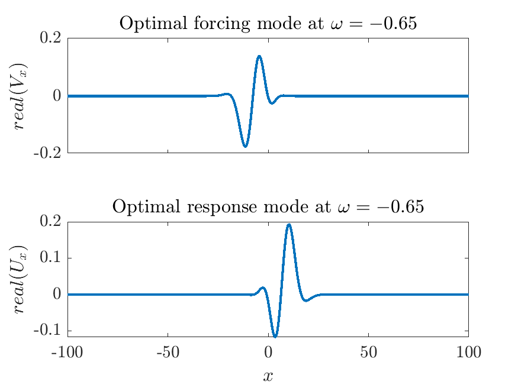

# Tutorial: Computing resolvent modes of the Ginzburg-Landau system using $\text{RSVD}-\Delta t$

---

## Introduction

In this tutorial, we will walk through the process of using the $\text{RSVD}-\Delta t$ algorithm on a Ginzburg-Landau test case. We showcase both the transient run (the pre-processing step) and the main algorithm (for computing resolvent modes). We also describe all related input variables and the logistics of I/O directories. 

The linearized operator is provided [here](./). This operator is the one we used in our [paper](https://arxiv.org/pdf/2309.04617.pdf).

## List of input variables

Here is a list of variables used for this test case. Please note that you will need to modify these variables to suit your own projects.

```yaml
# Root directory (string) 
# This directory must exist before the simulation
RootDir:          /path/to/root/directory/

# Results directory (string)
# The resolvent modes/gains will be saved in RootDir/ResultsDir/ResolventModes_<int>
# This directory must exist before the simulation
ResultsDir:       /path/to/results/

# The linearized operator (matrix - usually very sparse and saved in binary format)
# The operator directory is defined as RootDir/OperatorDir
# This directory must exist before the simulation, OperatorDir can be same as ResultsDir
OperatorDir:      /path/to/A_GL

# Number of test vectors (integer)
k:                2

# Number of power iterations (integer)
q:                0

# Number of frequencies to resolve (integer - even number)
Nw:               42

# Base frequency (real)
# The resolvent modes will be computed at freuqency range (-Nw/2-1:1:Nw/2)*w
w:                0.05

# Convert frequencies to angular frequencies (boolean)
# if true: w <-- 2*pi*w, otherwise, w <-- w
TwoPI:            false

# Transient length (real)
TransientLength:  10

# Time step (real)
dt:               0.003

# Transient removal flag (boolean)
TransientRemoval: true

# Display options (integer 0 <= Display <= 2)
Display:          2

# Discounting flag (boolean)
# Applies discounting for unstable linear systems, A <-- A - beta I
DiscFlg:          false

# beta value when "DiscFlg = True", otherwise beta is ignored (real > 0)
beta:             0.1

# Seeding random number to replicate data if needed (integer)
RandSeed:         14

# Saving resolvent modes options (integer 1 <= SaveResultsOpt <= 2)
SaveResultsOpt:   1

# Runs the transient simulation if true, otherwise RSVD-delta-t will run (boolean)
TransRun:         false

# All variables below this are relevant when TransRun is true

# Number of periods to integrate (integer)
TransPeriods:     3

# Saves the transient outputs if true (boolean)
TransSave:        false

# Saves the snapshots every "TransSaveMod" number (integer)
# The snapshots will be saved in RootDir/ResultsDir/TransientSnapshots_<int>
TransSaveMod:     500

# Estimates the transient error using our strategy if true (boolean)
TransRemovalEst:  false

# Divergence value, the transient simulation will stop when reached (real)
TransDivVal:      1e3

# Convergence value, the transient simulation will stop when reached (real)
TransConVal:      1e-6
```

### Important notes:

- For boolean flags, the following values are equivalent:
  - `False`, `false`, and `0` all represent `false`
  - `True`, `true`, and `1` all represent `true`

- Mathematical expressions in inputs are not allowed; for example, `2 x 2`, `√3`, and `π` will generate errors.

- For integer values, ensure only integers are provided. Decimal values such as `2.5`, `1.`, or `3.14` will cause errors.

- When using discounting, ensure `beta` is positive.

- Error messages will be displayed, and the simulation will terminate if an error occurs.


## Running the $\text{RSVD}-\Delta t$ algorithm executable

### Prerequisite modules

Make sure you have the following prerequisite modules loaded/installed:

- OpenMPI (or another MPI package such as MPICH)
- A C++ compiler
- PETSc and SLEPc packages

Note that the same versions of the C++ compiler and MPI module that were used to compile PETSc and SLEPc must be used to build the executable. Please refer to [README](./../../README.md) for instructions on installing PETSc and SLEPc.

The process of running the $\text{RSVD}-\Delta t$ algorithm can be divided into two main parts: the transient simulation and the main $\text{RSVD}-\Delta t$ algorithm. Before defining the variables specific to each part, we will first cover the variables that are common to both.

### Common variables between transient and $\text{RSVD}-\Delta t$

- `RootDir`: Specifies the root directory path for the simulation.
- `ResultsDir`: Defines the path to the results directory where output files will be saved. This directory must exist within `RootDir`. If it does not, the system will create the directory at the specified path. Ensure you have write access to the root directory, or an error message will be displayed.
- `OperatorDir`: Specifies the directory path for the linearized operator matrix. If the operator is located in the `RootDir`, you only need to provide the operator name (e.g., `A_GL`). Otherwise, specify the relative path to the operator from `RootDir` (e.g., `matrices/A_GL`).
- `RandSeed`: Indicates the seeding number for random number generation. Using the same number of cores and `RandSeed` value allows for repeatable results in simulations.
- `DiscFlg`: A boolean flag indicating whether to use a discounting strategy.
- `beta`: Specifies the beta value when `DiscFlg = true`. It is ignored if `DiscFlg = false`.

### Transient simulation

Before running the actual RSVD-\Delta t algorithm, it is often necessary to perform a transient simulation to ensure the stability of the system and determine the transient decay rate.

To run the transient simulation, set the `TransRun` flag to `true` in the input file (`variables.yaml`).

### Transient variables

- `TransPeriods`: Determines the length of the transient simulation. We define the period length as $T = \frac{2\pi}{\omega_{min}}$, where $\omega_{min}$ (defined by the variable `w`) is the base frequency.
- `TransRemovalEst`: If `true`, applies the transient removal strategy we developed for slowly decaying systems. It estimates the updated transient residual at the end of each period.
- `TransDivVal` and `TransConVal`: Divergence and convergence values, respectively, which stop the simulation if the transient norm reaches either value.

### Saving transient results

- A folder is created in the results directory with the prefix `TransientSnapshots_<int>`, where `<int>` is an integer starting from 0. If `TransientSnapshots_i` already exists, the code increments the integer until a unique folder name is found, ensuring that results from different simulations are not overwritten.
- If `TransSave` is `true`, snapshots are saved as `q_transient_<int>` every `TransSaveMod` time steps in the results directory. In addition, the norm of the snapshots is saved in a vector `q_transient_norms`, and the last snapshot is saved as `q_transient_last_snapshot`.
- If `TransSave` is `false`, only `q_transient_norms` and `q_transient_last_snapshot` are saved.
- If `TransRemovalEst` is `true`, the simulation saves the initial and updated transient norms to `Initial_transient_norm_period_<int>` and `Updated_transient_norm_period_<int>`, respectively, at the end of each period. For instance, `Initial_transient_norm_period_1` and `Updated_transient_norm_period_1` contain the norm of snapshots across the frequency range at the end of the first period.
- Note that the order of frequencies is as follows: column 1 corresponds to frequency 0, column 2 to frequency $\omega$, and so on up to frequency $\frac{N_{\omega}}{2} \times \omega$. After this, the frequencies continue from $-\left(\frac{N_{\omega}}{2} + 1\right) \times \omega$ up to the last column, which represents the $-\omega$ frequency. This ordering is the same as that obtained from MATLAB's FFT function.

### Default values

If a transient variable is not specified or is commented out (using `#` before it), a warning message will be displayed, and the default value will be used instead. The default values are as follows:

1. `TransRun`: `false`
2. `TransPeriods`: `1`
3. `TransSave`: `false`
4. `TransRemovalEst`: `false`
5. `TransDivVal`: `1e3`
6. `TransConVal`: `1e-6`
7. `RandSeed`: `1373`

For consistency and to avoid confusion, all variables starting with `Trans` are used exclusively in the transient part of the analysis.

### $\text{RSVD}-\Delta t$ Algorithm

Setting `TransRun = false` runs the $\text{RSVD}-\Delta t$ algorithm by default.

### $\text{RSVD}-\Delta t$ Variables

- `k`: The number of test vectors.
- `q`: The number of power iterations.
- `Nw`: The number of frequencies to resolve.
- `w`: The base frequency.
- `TwoPI`: Indicates whether to convert frequencies to angular frequencies. If `true`, the output frequencies are converted to angular frequencies by multiplying by \(2\pi\).
- `TransientLength`: The length of the transient simulation.
- `dt`: The time step for transient simulations.
- `TransientRemoval`: Determines whether the transient removal strategy is used.
- `Display`: Controls the amount of information printed during computation, ranging from 0 (no output) to 2 (verbose output).
  - `Display = 0`: Minimal output, with no information displayed.
  - `Display = 1`: Standard output, displaying:
    - Problem information
    - Elapsed time for each test vector
    - Total elapsed time
    - Estimated remaining time
  - `Display = 2`: Detailed output, including everything from `Display = 1`, plus the progress percentage of the first test vector.
- `SaveResultsOpt`: An integer option that controls the saving results format, with two possible values: 1 and 2.
  - `SaveResultsOpt = 1`: Saves resolvent modes as `k` matrices of size `N × Nw`.
  - `SaveResultsOpt = 2`: Saves resolvent modes as `Nw` matrices of size `N × k`.

### Saving Resolvent Modes

- A folder is created in the results directory with a fixed prefix `ResolventModes_<int>`, where `<int>` is an integer starting from 0. If `ResolventModes_i` exists, the code increments the integer until a unique folder name is found, ensuring that results from different simulations are not overwritten.

- Once the computation is complete, two saving formats are available:
  - **Option 1 when `SaveResultsOpt = 1`:**
    - `k` response modes (each of size `N × Nw`) are saved as `U_hat_k<int>_allFreqs`, where `<int>` represents the integer index of the mode.
    - Forcing modes are similarly saved as `V_hat_k<int>_allFreqs`.
    - For instance, `U_hat_k1_allFreqs` and `V_hat_k1_allFreqs` contain the optimal response and forcing modes, respectively, across all frequencies of interest.
    - The order of columns corresponds to the optimality of the test vectors: column 1 contains the optimal mode, column 2 contains the first suboptimal mode, and so on.

  - **Option 2 when `SaveResultsOpt = 2`:**
    - `Nw` response modes (each of size `N × k`) are saved as `U_hat_Freq<int>_allK`, where `<int>` represents the integer index of the frequency.
    - Forcing modes are similarly saved as `V_hat_Freq<int>_allK`.
    - For instance, `U_hat_Freq1_allK` and `V_hat_Freq1_allK` contain the response and forcing modes, respectively, associated with the first frequency.
    - The order of frequencies starts with column 1 (frequency 0), column 2 (frequency $\omega$), up to frequency $\frac{N_{\omega}}{2} \times \omega$, and then from $-\left(\frac{N_{\omega}}{2} + 1\right) \times \omega$ up to the last column that contains the $-\omega$ frequency (equivalent to MATLAB ordering).

- Finally, gains are saved as a single matrix `S_hat` of size `k × Nw` in either case.

**Important note:** Not all variables have default values. If a variable is not specified, you will receive a warning or error message.

### Default Values for Some Variables

The following default values are used if a variable is not specified in the input list:

1. `k`: `3`
2. `q`: `0`
3. `TwoPI`: `false`
4. `TransientRemoval`: `false`
5. `Display`: `2`
6. `DiscFlg`: `false`
7. `RandSeed`: `1373`

### Required Variables

The following variables must be specified as they have no default values:

- `RootDir`
- `ResultsDir`
- `OperatorDir`
- `TransientLength`
- `w`
- `Nw`
- `dt`
- `beta` (only when `DiscFlg` is `true`)

## Transfer Data Between MATLAB and PETSc/SLEPc Binary Format

You may frequently need to transfer data between PETSc/SLEPc and MATLAB for post-processing results. This section will guide you through the process of converting data formats to ensure compatibility and seamless integration between MATLAB and PETSc/SLEPc.

### Converting Data from MATLAB to PETSc/SLEPc

MATLAB can save data in various formats, but for use with PETSc/SLEPc, we need to ensure the data is saved in a binary format compatible with these libraries. PETSc provides MATLAB functions to facilitate this conversion.

1. **Add PETSc MATLAB Path:**

    Ensure you add the PETSc MATLAB interface to your MATLAB path:
    ```matlab
    addpath('/path/to/PETSc/share/petsc/matlab/');
    ```

2. **Save Data in MATLAB:**

    Create your matrix in MATLAB and save it using PETSc's binary write function. We have provided A_GL in both binary and .mat formats which you can test.
    ```matlab
    PetscBinaryWrite('/path/to/your/matrix/A', A_GL, 'complex', true, 'indices', 'int64');
    ```
    Note that `A` is an example name for the binary saved file. `A_GL` is the variable in MATLAB. Depending on the PETSc architecture that you have compiled, `'complex', true` and `'indices', 'int64'` can be different. Please refer to `PetscBinaryWrite` function for more information.

3. **Load Data in PETSc:**

    You can now load the binary file in your PETSc/SLEPc environment:
    ```c
    Mat A;
    PetscViewer viewer;
    
    PetscViewerBinaryOpen(PETSC_COMM_WORLD, "/path/to/your/matrix/A", FILE_MODE_READ, &viewer);
    MatCreate(PETSC_COMM_WORLD, &A);
    MatSetType(A, MATSEQAIJ); // or MATMPIAIJ if parallel (depending on your matrix, you can vary the type)
    MatLoad(A, viewer);
    PetscViewerDestroy(&viewer);
    ```

### Converting Data from PETSc/SLEPc to MATLAB

To transfer data from PETSc/SLEPc to MATLAB, follow these steps:

1. **Save Data in PETSc/SLEPc:**

    Save the matrix data in PETSc's binary format:
    ```c
    PetscViewer viewer;
    
    PetscViewerBinaryOpen(PETSC_COMM_WORLD, "/path/to/your/matrix/A", FILE_MODE_WRITE, &viewer);
    MatView(A, viewer);
    PetscViewerDestroy(&viewer);
    ```

2. **Load Data in MATLAB:**

    Read the PETSc binary file in MATLAB:
    ```matlab
    addpath('/path/to/PETSc/share/petsc/matlab/');
    A = PetscBinaryRead('/path/to/your/matrix/A', 'complex', true, 'indices', 'int64');
    ```

You do not need to be concerned with coding in the PETSc environment. Your primary task is to save your operator in binary format (from `.mat` to `.bin`) and to read your data from binary format into MATLAB (from `.bin` to `.mat`). For completeness, we have provided explanations for both directions.

## Tutorial example results for the Ginzburg-Landau problem

To ensure that your installation of the code is producing correct results, we provide example outputs for the Ginzburg-Landau problem using parameters in the original `variables.yaml`. Users can compare their results with the results below.

### Transient simulation results

By setting `TransRun = true`, we executed the transient simulation using the provided input values. The transient norms over time are then loaded into MATLAB and plotted as follows:
```matlab
set(groot, 'defaultTextInterpreter','latex'); 
addpath('/path/to/PETSc/share/petsc/matlab/');
norms_vec = PetscBinaryRead('/path/to/results/TransientSnapshots_0/q_transient_norms', 'complex', true, 'indices', 'int64');
norms_vec = full(norms_vec);   % Convert sparse to full format
norms_vec = real(norms_vec);   % Convert complex-valued numbers to real-valued numbers
dt        = 0.003;             % Time step for transient simulation
mod       = 500;               % Norms computed every 'mod' iterations including the initial condition at t = 0
delta_t   = mod * dt;          % Time distance between norms
% Plotting
semilogy((1:length(norms_vec)) * delta_t, norms_vec, 'linewidth', 2);
set(gca, 'fontsize', 14);
title('Decay of transient norm decay over time');
xlabel('$t$');
ylabel('$||q_t||$');
```
Figure below shows the transient norm for the Ginzburg-Landau problem. The transient norm is expected to decay over time, but the decay trajectory may vary based on the random initial condition. Thus, slight deviations from the plotted results are within the realm of expectation.


### Gain spectrum
By setting `TransRun = false`, we executed the $\text{RSVD}-\Delta t$ simulation using the provided input values. The gain spectrum is then loaded into MATLAB and plotted as follows:
```matlab
set(groot, 'defaultTextInterpreter','latex'); 
addpath('/path/to/PETSc/share/petsc/matlab/');
S         = PetscBinaryRead('/path/to/results/ResolventModes_0/S_hat', 'complex', true, 'indices', 'int64');
S         = full(S);        % Convert sparse to full format
S         = real(S);        % Convert complex-valued numbers to real-valued numbers
S         = fftshift(S, 2); % Organize the frequencies as -w_max:w_min:w_max
k         = 3;              % Number of modes to display
w_min     = 0.05;           % Base frequency
Nw        = 42;             % Number of frequencies
% Plotting
semilogy((-Nw/2+1:Nw/2-1)*w_min, S(1:k,2:end), 'linewidth', 2);
set(gca, 'fontsize', 14);
title('Gain plot');
xlabel('$\omega$');
ylabel('$\sigma$');
legend('Optimal mode', 'First suboptimal mode', 'Second suboptimal mode')
```

Since we set `q = 1`, we expect the gain plots to converge, so small to no deviation from the gain plot in figure below is expected. 


### Forcing and response modes
To complete the process, we will also present the forcing and response modes at the peak frequencies. From the gain plot, we observe that the peak frequency occurs at $\omega = -0.65$. We plot the optimal forcing and response, primarily to illustrate how the modes are ordered in the results matrices. The modes can be loaded into MATLAB and plotted as follows:
```matlab
set(groot, 'defaultTextInterpreter','latex'); 
addpath('/path/to/PETSc/share/petsc/matlab/');
U         = PetscBinaryRead('/path/to/results/ResolventModes_0/U_hat_k1_allFreqs', 'complex', true, 'indices', 'int64');
V         = PetscBinaryRead('/path/to/results/output/ResolventModes_0/V_hat_k1_allFreqs', 'complex', true, 'indices', 'int64');
U         = full(U);                    % Convert sparse to full format
V         = full(V);                    % Convert sparse to full format
U         = fftshift(U, 2);             % Organize the frequencies as -w_max:w_min:w_max
V         = fftshift(V, 2);             % Organize the frequencies as -w_max:w_min:w_max
w_min     = 0.05;                       % Base frequency
Nw        = 42;                         % Number of frequencies
w         = (-Nw/2:Nw/2-1)*w_min;       % Desired range of frequency
index     = find(abs(w-(-0.65))<1e-6);  % Find the index of the peak frequency
U_plot    = U(:,index);                 % Response mode associated with the highest gain
V_plot    = V(:,index);                 % Forcing mode associated with the highest gain
x         = linspace(-100, 100, 500);   % Construct the mesh for visualization
% Plotting
subplot(2, 1, 1);
plot(x, real(V_plot), 'linewidth', 2);
set(gca, 'fontsize', 14);
title('Optimal forcing mode at $\omega = -0.65$');
set(gca,'XTickLabel',[])
ylabel('$real(V_x)$');
subplot(2, 1, 2);
plot(x, real(U_plot), 'linewidth', 2);
set(gca, 'fontsize', 14);
title('Optimal response mode at $\omega = -0.65$');
xlabel('$x$');
ylabel('$real(U_x)$');
```
We expect the modes to remain qualitatively unchanged, although phase shifts may occur.



These results should serve as a benchmark for your implementation. If your outputs differ significantly, please review your setup and parameters.
    
## Conclusion
In this tutorial, we covered the setup and execution of the $\text{RSVD}-\Delta t$ algorithm for computing resolvent modes of the Ginzburg-Landau system. We discussed input variables, the process of running the algorithm, saving results, and provided reference results for comparison. Depending on your specific problems, you may need to adjust the input variables accordingly. Experimentation and iteration are often essential for achieving optimal results.

If you have any further questions or encounter any issues, don't hesitate to reach out for assistance.


